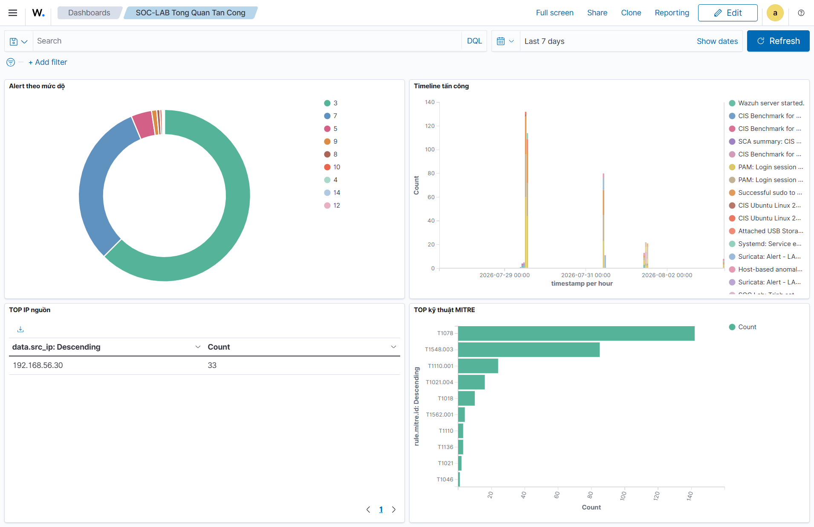

# SOC Detection Lab - Phat hien tan cong theo MITRE ATT&CK

> Home lab mo phong mot Security Operations Center thu nho: Suricata (NIDS) +
> Wazuh (HIDS/SIEM) phat hien va tuong quan mot chuoi tan cong hoan chinh,
> anh xa chuan MITRE ATT&CK, truc quan hoa tren dashboard tu dung.

## Kien truc

- **Attacker:** Kali Linux (192.168.56.30)
- **Victim:** Ubuntu 22.04 + Suricata + Wazuh agent (192.168.56.20)
- **SIEM:** Wazuh manager/indexer/dashboard (Docker trong WSL2)

## Tinh nang chinh
- Phat hien da tang: recon -> port scan -> brute force -> account takeover
- Custom rules phan tang muc do 7/10/12/14 (thay cho muc 3 phang cua Suricata)
- Anh xa MITRE ATT&CK tren tung alert
- Luat tuong quan da nguon: brute force + dang nhap thanh cong -> canh bao chiem tai khoan
- Dashboard SOC tu dung, export duoc ra .ndjson

## Anh xa MITRE ATT&CK

| Giai doan | Technique | Rule ID | Level |
|-----------|-----------|---------|-------|
| Remote System Discovery | T1018 | 100101 | 7 |
| Network Service Scanning | T1046 | 100102 | 10 |
| Brute Force (NIDS) | T1110 | 100103 | 12 |
| Brute Force (HIDS) | T1110.001 | 100110 | 12 |
| Account Takeover | T1078, T1021.004 | 100111 | 14 |
| HTTP GET Beaconing (Periodic Polling) | T1071.001 | 100001 | 12 |
| C2 Header Steganography | T1001.002 | 100002 | 12 |
| Persistence: Crontab modification by unexpected process | T1053.003 | 100201 | 12 |
| Persistence: User crontab modification via crontab command | T1053.003 | 100202 | 7 |
| Execution: Non-interactive shell spawned | T1059.004 | 100203 | 12 |
| Execution: Repeated non-interactive shell from same parent | T1059.004, T1102.002 | 100204 | 15 |
| Defense Evasion: Ephemeral .tmp credential staging | T1027 | 100205 | 8 |
| Command and Control: Suricata googleapis beacon | T1102.002 | 100206 | 14 |
| Command and Control: Suricata Drive REST API polling | T1102.002, T1071.001 | 100207 | 13 |
| Correlation: googleapis beacon + shell spawn on same host | T1102.002, T1059.004, T1071.001 | 100210 | 15 |
| Correlation: googleapis beacon + crontab persistence | T1102.002, T1053.003 | 100211 | 15 |

## Trien khai lai
Xem docs/architecture.md va docs/network-setup.md.
1. Clone wazuh-docker (v4.9.0), chay single-node.
2. Copy wazuh/rules/local_rules.xml vao manager, restart.
3. Copy suricata/local.rules vao Victim.
4. Import dashboards/soc-lab-dashboard.ndjson.

## Bai hoc rut ra
- Vi sao tach custom rule khoi ruleset goc (chuan doanh nghiep)
- Cach debug rule bang wazuh-logtest, bay field-name phang vs data.*
- Cach viet luat tuong quan da su kien (if_matched_sid + same_source_ip)

## Tac gia
VoChinh - 2026
